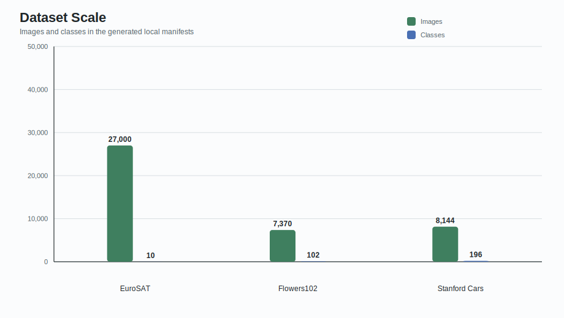
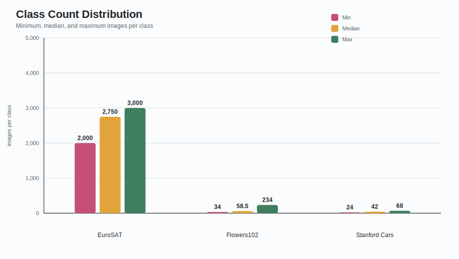
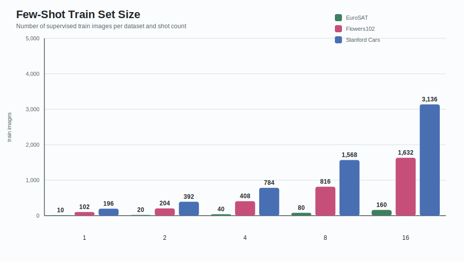
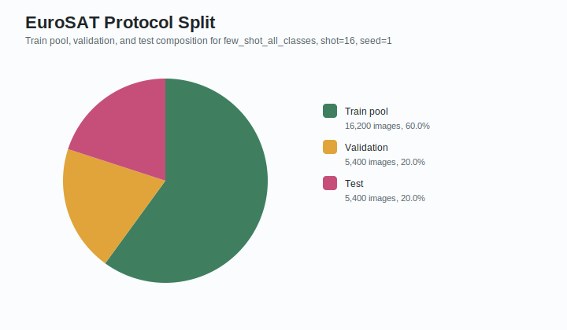
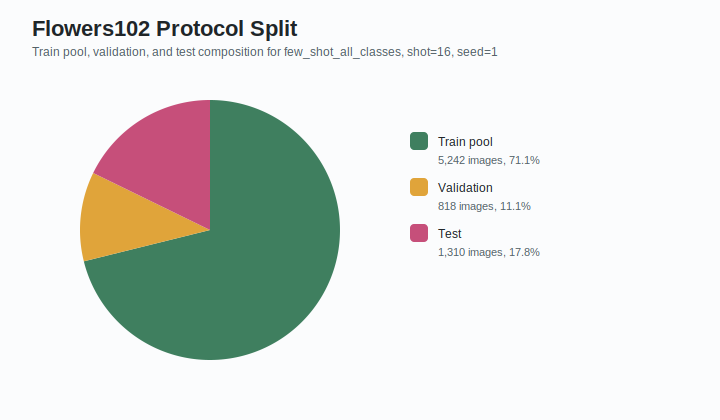
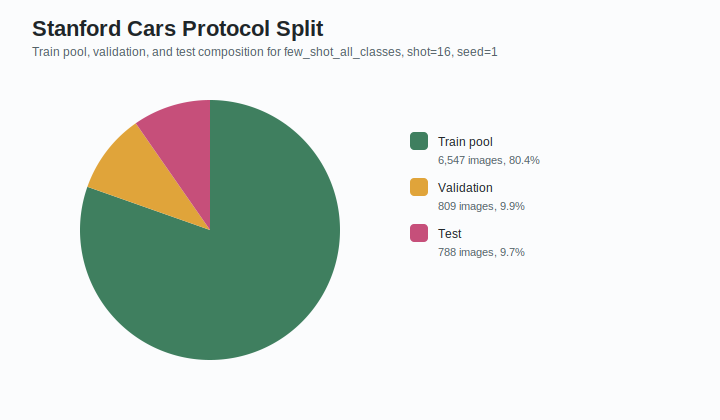

# Dataset Chart Pack

Generated from local manifests and split JSON files.

| Dataset | Images | Classes | Min/Class | Median/Class | Max/Class | Split Policy |
|---|---:|---:|---:|---:|---:|---|
| EuroSAT | 27,000 | 10 | 2,000 | 2,750 | 3,000 | stratified_from_all |
| Flowers102 | 7,370 | 102 | 34 | 58.5 | 234 | source_train_val_test_from_train |
| Stanford Cars | 8,144 | 196 | 24 | 42 | 68 | source_train_only_val_test_from_train |

## Charts

