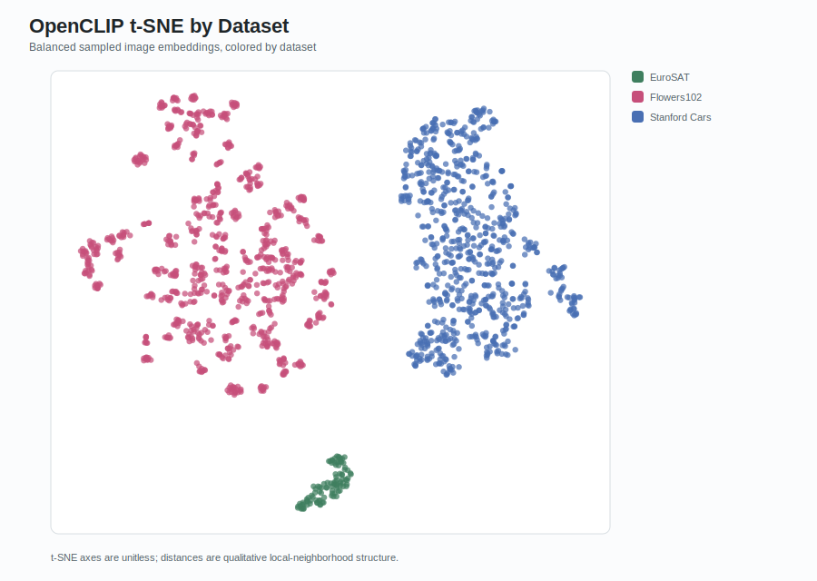
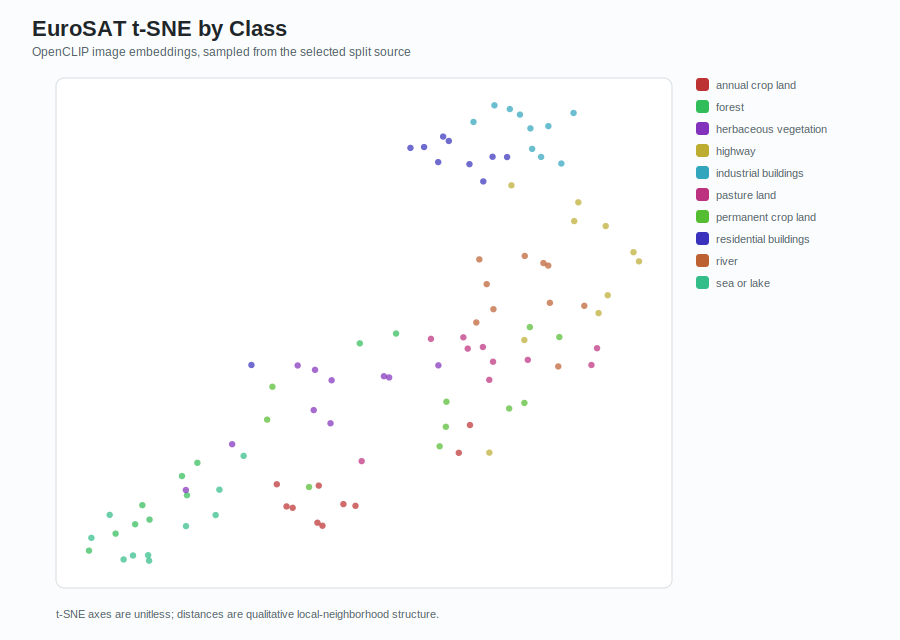
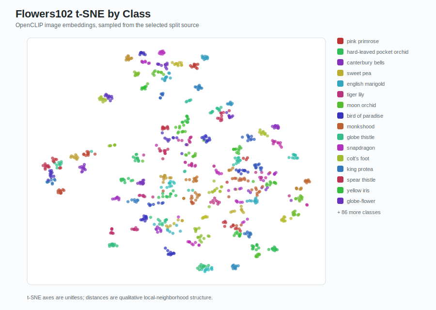
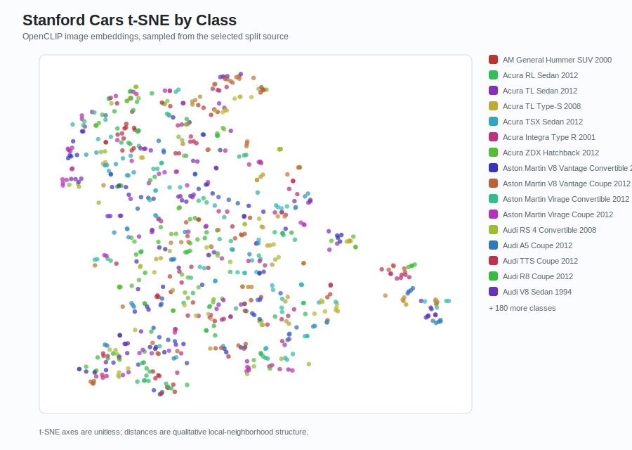

# Embedding t-SNE Analysis

Generated from OpenCLIP image embeddings using local manifests and split files.

## Settings

- Source: `split-test`
- Protocol: `few_shot_all_classes`
- Shots/seed for split source: `16` / `1`
- Max samples per class: `10`
- Model: `ViT-B-32-256`
- Pretrained: `datacomp_s34b_b86k`

## Charts

