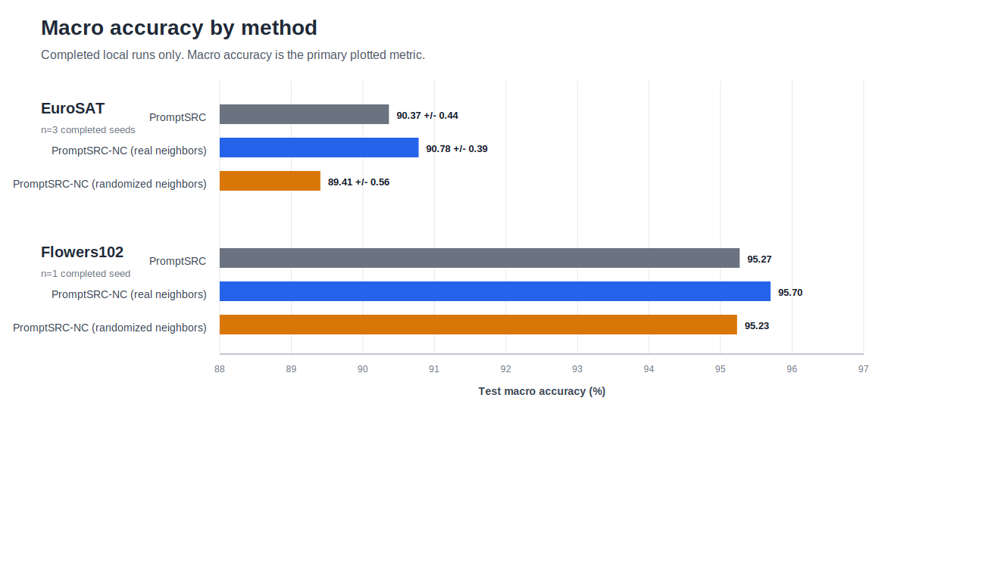
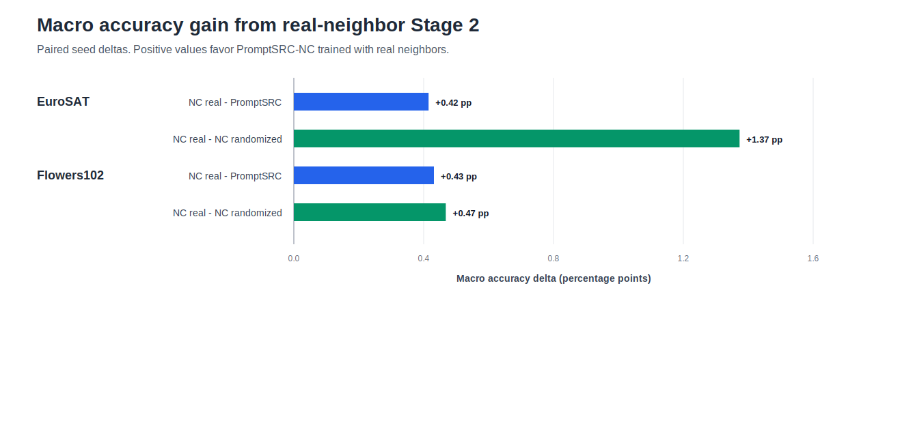
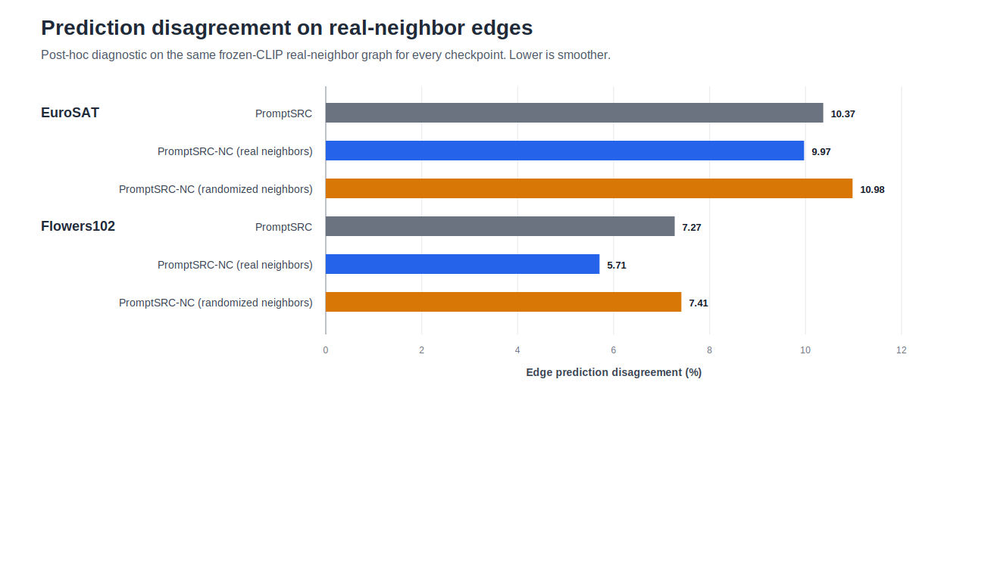

# PromptSRC-NC Constrained Results Tables

These tables summarize the completed constrained experiments at **16 shots per class** with **ViT-B/16 / OpenAI CLIP**. No line charts are included because shot count was not varied.

## Scope And Caveats

- EuroSAT completed for three seeds: `promptsrc-nc-main-20260510-192529`.
- Flowers102 completed for one seed only: `promptsrc-nc-main-20260510-192533`. Treat this as a pilot result.
- Stanford Cars did not complete Stage 1/evaluation: `promptsrc-nc-main-20260510-192531`. It is included only for the external zero-shot reference.
- Zero-shot CLIP values are from **2SFS CVPR 2025 Table 2, ViT-B/16 Zero-Shot row (all-to-all, k=16 shots per class)**: [https://openaccess.thecvf.com/content/CVPR2025/papers/Farina_Rethinking_Few-Shot_Adaptation_of_Vision-Language_Models_in_Two_Stages_CVPR_2025_paper.pdf](https://openaccess.thecvf.com/content/CVPR2025/papers/Farina_Rethinking_Few-Shot_Adaptation_of_Vision-Language_Models_in_Two_Stages_CVPR_2025_paper.pdf). These are paper reference values, not rerun in this workspace.
- Local PromptSRC-NC uses the unlabeled pool policy `full_training_split_minus_fewshot_labeled_train`; test images are not used as unlabeled data.
- PromptSRC rows in the diagnostics section are diagnostic baselines: the checkpoint is evaluated on the same real-neighbor graph, but it was not trained with the neighborhood loss.

## Local Macro Accuracy Table

Macro test accuracy is the primary local metric in this constrained report. Top-1 is retained only in the CSV for auditability and for the external zero-shot reference, because the sourced zero-shot paper table does not report macro accuracy.

| Dataset | Method | Macro (%) | n | Source |
| --- | --- | --- | --- | --- |
| EuroSAT | PromptSRC | 90.37 +/- 0.44 | 3 | local PromptSRC-NC run |
| EuroSAT | PromptSRC-NC (real neighbors) | 90.78 +/- 0.39 | 3 | local PromptSRC-NC run |
| EuroSAT | PromptSRC-NC (randomized neighbors) | 89.41 +/- 0.56 | 3 | local PromptSRC-NC run |
| Flowers102 | PromptSRC | 95.27 | 1 | local PromptSRC-NC run |
| Flowers102 | PromptSRC-NC (real neighbors) | 95.70 | 1 | local PromptSRC-NC run |
| Flowers102 | PromptSRC-NC (randomized neighbors) | 95.23 | 1 | local PromptSRC-NC run |
| Stanford Cars | PromptSRC | - | 0 | not completed / not available |
| Stanford Cars | PromptSRC-NC (real neighbors) | - | 0 | not completed / not available |
| Stanford Cars | PromptSRC-NC (randomized neighbors) | - | 0 | not completed / not available |

## External Zero-Shot Reference

The available sourced zero-shot values are top-1 only, so they are kept separate from the macro-primary local comparison.

| Dataset | Zero-shot CLIP top-1 (%) | Source |
| --- | --- | --- |
| EuroSAT | 47.5 | 2SFS CVPR 2025 Table 2, ViT-B/16 Zero-Shot row (all-to-all, k=16 shots per class) |
| Flowers102 | 71.4 | 2SFS CVPR 2025 Table 2, ViT-B/16 Zero-Shot row (all-to-all, k=16 shots per class) |
| Stanford Cars | 65.3 | 2SFS CVPR 2025 Table 2, ViT-B/16 Zero-Shot row (all-to-all, k=16 shots per class) |

## Paired Effect Sizes

Deltas are percentage points. Positive values mean **PromptSRC-NC trained with real neighbors** is higher than the named comparator.

| Dataset | Paired seeds | Macro: NC real - PromptSRC | Macro: NC real - NC randomized |
| --- | --- | --- | --- |
| EuroSAT | 3 | 0.42 | 1.37 |
| Flowers102 | 1 | 0.43 | 0.47 |

## Diagnostics Table

This table does **not** say every method used neighborhood training. It asks: after training each checkpoint, how often do its predictions disagree across the fixed real frozen-CLIP neighbor edges? Lower edge disagreement means smoother predictions on that graph.

| Dataset | Checkpoint trained as | Diagnostic graph | n | Edge prediction disagreement (%) | Mean JS | Mean entropy | Mean confidence (%) |
| --- | --- | --- | --- | --- | --- | --- | --- |
| EuroSAT | PromptSRC | fixed real frozen-CLIP neighbor edges | 3 | 10.37 | 0.0405 | 0.6149 | 81.85 |
| EuroSAT | PromptSRC-NC (real neighbors) | fixed real frozen-CLIP neighbor edges | 3 | 9.97 | 0.0393 | 0.6119 | 82.04 |
| EuroSAT | PromptSRC-NC (randomized neighbors) | fixed real frozen-CLIP neighbor edges | 3 | 10.98 | 0.0386 | 0.7990 | 76.03 |
| Flowers102 | PromptSRC | fixed real frozen-CLIP neighbor edges | 1 | 7.27 | 0.0498 | 0.4148 | 89.19 |
| Flowers102 | PromptSRC-NC (real neighbors) | fixed real frozen-CLIP neighbor edges | 1 | 5.71 | 0.0436 | 0.3709 | 90.44 |
| Flowers102 | PromptSRC-NC (randomized neighbors) | fixed real frozen-CLIP neighbor edges | 1 | 7.41 | 0.0506 | 0.4403 | 88.58 |

## Visualizations

## Files

- `summary_accuracy.csv`: method comparison table with macro accuracy plus top-1 retained for audit/reference.
- `delta_summary.csv`: paired macro and top-1 effect-size table; report and charts use macro.
- `per_seed_accuracy.csv`: per-seed local test/validation metrics and checkpoint roles.
- `diagnostics_summary.csv`: averaged diagnostics by dataset and checkpoint type.
